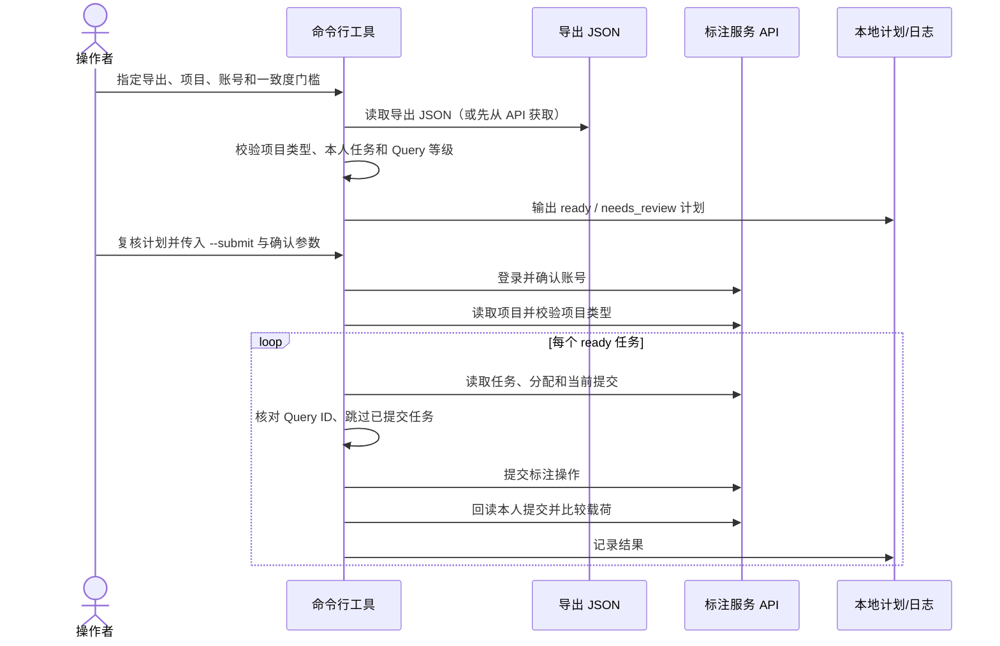

# 架构说明

## 组件与数据流

```mermaid
flowchart LR
    Source{数据来源} --> Local[本地项目导出 JSON]
    Source --> Online[可选：登录后请求在线导出]
    Online --> API[标注服务 API]
    Local --> Load[JSON 读取与结构校验]
    API --> Load
    Load --> Project[校验项目 ID / semantic_relevance]
    Project --> Filter[按账号、分配状态和任务 ID 筛选]
    Filter --> Pair[校验 Query ID 与 0–3 等级]
    Pair --> Agreement[计算候选模型一致比例]
    Agreement --> Split{最低一致度}
    Split -->|达标| Ready[ready 计划]
    Split -->|未达标| Review[needs_review 计划]
    Ready --> Plan[写入本地预览计划]
    Review --> Plan
    Plan --> Gate{明确提交确认?}
    Gate -->|否| Preview[只预览，不登录、不写服务端]
    Gate -->|是| Auth[登录并核对本人身份]
    Auth --> Check[校验在线项目、本人任务和 Query ID]
    Check --> Submit[逐条提交本人答案]
    Submit --> Verify[回读服务端结果并比较]
    Verify --> Log[写入本地运行日志]
```

## 在线提交时序

## 代码模块

| 模块/函数 | 职责 |
| --- | --- |
| `ApiClient` | 会话 Cookie、JSON 请求、有限重试和登录验证 |
| `load_json` | 检查导出文件是否为有效 JSON 对象 |
| `build_item_plan` / `build_plan` | 筛选本人未提交任务，验证 Query 和等级，计算一致度并分流 |
| `plan_to_dict` | 序列化可复核的计划和计数 |
| `fetch_online_export` | 可选地从服务端导出指定项目数据 |
| `submit_plan` | 再次校验在线任务、提交并回读核验 |
| `run` | 参数检查、生成计划、可选提交和日志写入 |

## 外部接口

服务专属路径不会打包。逻辑操作和本地路由映射见 [集成边界](integration-boundary.md)。本工具不调用模型服务；模型等级和候选等级应已存在于导出文件中。
